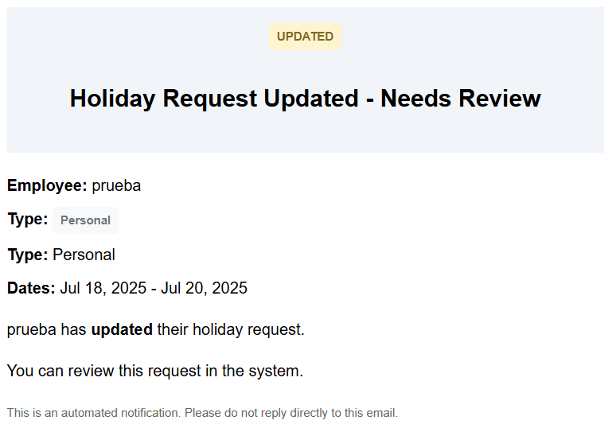

# Staff Management - Sergio

This is a web application for managing Employee Hours and Vacation Records using Calendars and Departments.  
The web app is built using: [filamentPHP](https://filamentphp.com)

The system has 3 types of users with different roles and 2 panels located in `/admin` and `/personal`:

- **Super Admin**:
    - Full permissions.

- **Admin**:
    - Permissions for CRUD (Create, Read, Update, Delete) of all resources except Roles.
    - Access to the Admin panel and their own Personal panel as a user.

- **Personal**:
    - Access and permissions only over their own records.
    - CRUD on Timesheets and access to custom buttons for ease of use.
    - CRUD on Holidays. They can only edit if the status is "pending."

---

## Super Admin

<strong>Roles</strong>

  

Permissions are managed using the Shield Plugin (link at the end).

---

## Admin

<strong>Dashboard</strong>

The Dashboard provides various utility widgets for a quick overview of important admin-related tasks.  
The charts have functional filters to change search ranges between week/month/year...

<strong>Timesheets</strong>

Example of filtering in Timesheets.

<strong>Holidays</strong>

<strong>Employees</strong>

Admins cannot view Super Admin Users.
  

The selectors for State and City automatically filter based on the selected Country and State.

<strong>Departments</strong>

The table shows a count of Users for each Department.

<strong>Calendars</strong>

Calendars have an "active" field. By default, all new entries for Timesheets/Holidays use the active Calendar.

---

## Personal

<strong>Dashboard</strong>

The Dashboard provides various utility widgets for a quick overview of the most important user-related tasks.

<strong>Timesheets</strong>

The top buttons change depending on the last entry, allowing users to start/stop work or take breaks.

<strong>Holidays</strong>

Holidays can only be edited/deleted if their status is still "pending."

User functionalities are presented in modals rather than separate pages.

---

## Emails and Notifications

<strong>Notification</strong>

Whenever a resource is created/edited/deleted, a temporary notification appears on the page to inform the user.  
For Holidays, creating/editing automatically sends email notifications.

<strong>Emails</strong>

  
  

---

## Extras

<strong>altwaireb/laravel-countries</strong>

To populate the database with Country/State/City, I used:  
[altwaireb/laravel-countries](https://packagist.org/packages/altwaireb/laravel-countries)

<strong>Mailer</strong>

For email testing, I used [Mailtrap](https://mailtrap.io)

<strong>Plugins</strong>

- For assigning permissions and roles: [Shield](https://filamentphp.com/plugins/bezhansalleh-shield)  
- For exporting to Excel: [Excel](https://filamentphp.com/plugins/pxlrbt-excel)

